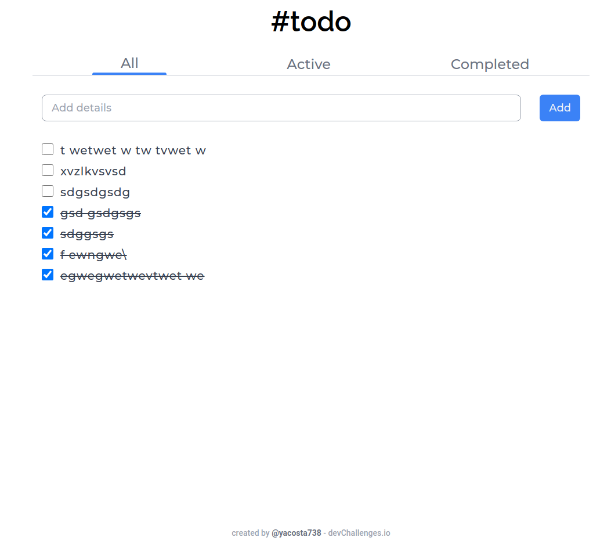

<!-- Please update value in the {}  -->

<h1 align="center">Todo-App</h1>

<div align="center">
   Solution for a challenge from  <a href="http://devchallenges.io" target="_blank">Devchallenges.io</a>.
</div>

<div align="center">
  <h3>
    <a href="https://task-app-acosta.vercel.app/">
      Demo
    </a>
    <span> | </span>
    <a href="https://github.com/yacosta738/todo-app">
      Solution
    </a>
    <span> | </span>
    <a href="https://devchallenges.io/challenges/hH6PbOHBdPm6otzw2De5">
      Challenge
    </a>
  </h3>
</div>

<!-- TABLE OF CONTENTS -->

## Table of Contents

- [Overview](#overview)
    - [Built With](#built-with)
- [Features](#features)
- [How to use](#how-to-use)
- [Contact](#contact)
- [Acknowledgements](#acknowledgements)

<!-- OVERVIEW -->

## Overview



Todo app is a simple todo list app that allows you to add, delete and edit your todo list.

### Built With

<!-- This section should list any major frameworks that you built your project using. Here are a few examples.-->
- [Vue.js](https://vuejs.org/)
- [NuxtJs](https://v3.nuxtjs.org/)
- [Vite](https://vitejs.dev/)
- [Pinia](https://pinia.vuejs.org/)
- [Tailwind](https://tailwindcss.com/)

## Features

This application/site was created as a submission to a [DevChallenges](https://devchallenges.io/challenges) challenge. The [challenge](https://devchallenges.io/challenges/hH6PbOHBdPm6otzw2De5) was to build an application to complete the given user stories.

## How To Use
To clone and run this application, you'll need [Git](https://git-scm.com) and [Node.js](https://nodejs.org/en/download/) (which comes with [npm](http://npmjs.com)) installed on your computer. From your command line:

```bash
# Clone this repository
$ git clone https://github.com/yacosta738/todo-app

# Install dependencies
$ npm install

# Run the app
$ npm dev
```

## Contact

- Website [blastkode.com](https://blastkode.com)
- GitHub [@yacosta738](https://github.com/yacosta738)
- Twitter [@yacosta738](https://twitter.com/yacosta738)
